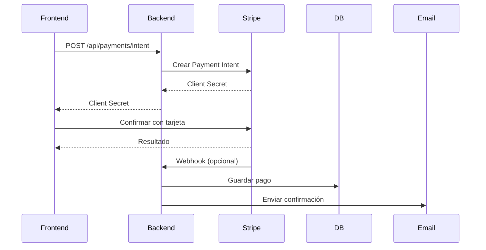

# Integración de Pagos con Tarjeta - SecurePass

## 📋 Descripción

Documentación completa para implementar pagos únicos con tarjeta de crédito/débito usando Stripe en SecurePass.

## 🎯 Funcionalidades

### Pagos Únicos (One-time Payments)

- Procesamiento de pagos con tarjeta
- Payment Intents de Stripe
- Confirmación de pagos
- Cancelación de pagos pendientes

### Gestión de Tarjetas

- Guardar métodos de pago
- Listar tarjetas guardadas
- Eliminar métodos de pago
- Setup Intents para guardar tarjetas sin cargo

### Gestión de Clientes

- Crear clientes en Stripe
- Asociar métodos de pago a clientes
- Historial de pagos por usuario

### Reembolsos

- Procesar reembolsos totales
- Procesar reembolsos parciales
- Registro de reembolsos

## 📡 API Endpoints

### 1. Crear Payment Intent

Crea un Payment Intent para procesar un pago.

```http
POST /api/payments/intent
Content-Type: application/json

{
  "userId": "user_id_here",
  "amount": 5000,  // $50.00 en centavos
  "currency": "USD",
  "description": "Pago por servicio premium",
  "metadata": {
    "orderId": "order_123",
    "customField": "valor"
  }
}
```

**Respuesta:**

```json
{
  "success": true,
  "clientSecret": "pi_xxx_secret_xxx",
  "paymentIntentId": "pi_xxx"
}
```

### 2. Procesar Pago con Tarjeta

Procesa un pago directamente con un método de pago.

```http
POST /api/payments/card
Content-Type: application/json

{
  "userId": "user_id_here",
  "paymentMethodId": "pm_xxx",
  "amount": 5000,
  "currency": "USD",
  "description": "Pago por servicio",
  "metadata": {
    "orderId": "order_123"
  }
}
```

**Respuesta:**

```json
{
  "success": true,
  "payment": {
    "id": "payment_id",
    "userId": "user_id",
    "amount": 5000,
    "status": "completed",
    "providerId": "pi_xxx"
  },
  "paymentIntent": {
    "id": "pi_xxx",
    "status": "succeeded"
  }
}
```

### 3. Confirmar Payment Intent

Confirma un Payment Intent existente.

```http
POST /api/payments/intent/:paymentIntentId/confirm
```

### 4. Obtener Estado de Payment Intent

```http
GET /api/payments/intent/:paymentIntentId/status
```

**Respuesta:**

```json
{
  "success": true,
  "status": {
    "id": "pi_xxx",
    "status": "succeeded",
    "amount": 5000,
    "currency": "usd",
    "created": "2024-01-15T10:30:00.000Z"
  }
}
```

### 5. Cancelar Payment Intent

```http
POST /api/payments/intent/:paymentIntentId/cancel
```

### 6. Crear Setup Intent (Guardar Tarjeta)

Crea un Setup Intent para guardar una tarjeta sin realizar un cargo.

```http
POST /api/payments/setup-intent
Content-Type: application/json

{
  "userId": "user_id_here"
}
```

**Respuesta:**

```json
{
  "success": true,
  "clientSecret": "seti_xxx_secret_xxx",
  "setupIntentId": "seti_xxx"
}
```

### 7. Obtener Métodos de Pago

```http
GET /api/payments/methods/:customerId
```

**Respuesta:**

```json
{
  "success": true,
  "paymentMethods": [
    {
      "id": "pm_xxx",
      "brand": "visa",
      "last4": "4242",
      "expMonth": 12,
      "expYear": 2025
    }
  ]
}
```

### 8. Eliminar Método de Pago

```http
DELETE /api/payments/methods/:paymentMethodId
```

### 9. Asociar Método de Pago a Cliente

```http
POST /api/payments/methods/attach
Content-Type: application/json

{
  "paymentMethodId": "pm_xxx",
  "customerId": "cus_xxx"
}
```

### 10. Crear Cliente

```http
POST /api/payments/customers
Content-Type: application/json

{
  "userId": "user_id_here",
  "email": "usuario@example.com",
  "name": "Juan Pérez"
}
```

**Respuesta:**

```json
{
  "success": true,
  "customerId": "cus_xxx"
}
```

### 11. Procesar Reembolso

```http
POST /api/payments/:paymentId/refund
Content-Type: application/json

{
  "amount": 2500,  // Opcional, si se omite reembolsa todo
  "reason": "requested_by_customer"  // duplicate, fraudulent, requested_by_customer
}
```

### 12. Obtener Historial de Pagos

```http
GET /api/payments/user/:userId?limit=10&offset=0
```

**Respuesta:**

```json
{
  "success": true,
  "payments": [...],
  "total": 25,
  "limit": 10,
  "offset": 0
}
```

### 13. Obtener Pago por ID

```http
GET /api/payments/:paymentId
```

## 💻 Integración Frontend

### Opción 1: Usar Stripe Elements (Recomendado)

#### 1. Instalar Stripe.js

```bash
npm install @stripe/stripe-js @stripe/react-stripe-js
```

#### 2. Configurar Stripe Provider

```jsx
import { Elements } from '@stripe/react-stripe-js';
import { loadStripe } from '@stripe/stripe-js';

const stripePromise = loadStripe('pk_test_your_publishable_key');

function App() {
  return (
    <Elements stripe={stripePromise}>
      <PaymentForm />
    </Elements>
  );
}
```

#### 3. Componente de Pago

```jsx
import { CardElement, useStripe, useElements } from '@stripe/react-stripe-js';
import { useState } from 'react';

function PaymentForm() {
  const stripe = useStripe();
  const elements = useElements();
  const [processing, setProcessing] = useState(false);

  const handleSubmit = async (event) => {
    event.preventDefault();

    if (!stripe || !elements) return;

    setProcessing(true);

    try {
      // 1. Crear Payment Intent en el backend
      const response = await fetch('/api/payments/intent', {
        method: 'POST',
        headers: { 'Content-Type': 'application/json' },
        body: JSON.stringify({
          userId: currentUser.id,
          amount: 5000, // $50.00
          currency: 'USD',
          description: 'Pago por servicio premium',
        }),
      });

      const { clientSecret } = await response.json();

      // 2. Confirmar el pago con Stripe
      const { error, paymentIntent } = await stripe.confirmCardPayment(clientSecret, {
        payment_method: {
          card: elements.getElement(CardElement),
          billing_details: {
            name: currentUser.name,
            email: currentUser.email,
          },
        },
      });

      if (error) {
        console.error('Error:', error);
        alert(`Error en el pago: ${error.message}`);
      } else if (paymentIntent.status === 'succeeded') {
        console.log('Pago exitoso!', paymentIntent);
        alert('¡Pago procesado exitosamente!');
      }
    } catch (err) {
      console.error('Error:', err);
    } finally {
      setProcessing(false);
    }
  };

  return (
    <form onSubmit={handleSubmit}>
      <CardElement
        options={{
          style: {
            base: {
              fontSize: '16px',
              color: '#424770',
              '::placeholder': {
                color: '#aab7c4',
              },
            },
            invalid: {
              color: '#9e2146',
            },
          },
        }}
      />
      <button type="submit" disabled={!stripe || processing}>
        {processing ? 'Procesando...' : 'Pagar $50.00'}
      </button>
    </form>
  );
}
```

### Opción 2: Guardar Tarjeta y Cobrar Después

#### 1. Guardar Tarjeta

```jsx
import { CardElement, useStripe, useElements } from '@stripe/react-stripe-js';

function SaveCardForm() {
  const stripe = useStripe();
  const elements = useElements();

  const handleSaveCard = async (event) => {
    event.preventDefault();

    // 1. Crear Setup Intent
    const response = await fetch('/api/payments/setup-intent', {
      method: 'POST',
      headers: { 'Content-Type': 'application/json' },
      body: JSON.stringify({ userId: currentUser.id }),
    });

    const { clientSecret } = await response.json();

    // 2. Confirmar Setup Intent
    const { error, setupIntent } = await stripe.confirmCardSetup(clientSecret, {
      payment_method: {
        card: elements.getElement(CardElement),
        billing_details: {
          name: currentUser.name,
          email: currentUser.email,
        },
      },
    });

    if (!error) {
      console.log('Tarjeta guardada:', setupIntent.payment_method);
      // Asociar a cliente si es necesario
      await fetch('/api/payments/methods/attach', {
        method: 'POST',
        headers: { 'Content-Type': 'application/json' },
        body: JSON.stringify({
          paymentMethodId: setupIntent.payment_method,
          customerId: currentUser.stripeCustomerId,
        }),
      });
    }
  };

  return (
    <form onSubmit={handleSaveCard}>
      <CardElement />
      <button type="submit">Guardar Tarjeta</button>
    </form>
  );
}
```

#### 2. Cobrar con Tarjeta Guardada

```jsx
async function chargeStoredCard(paymentMethodId, amount) {
  const response = await fetch('/api/payments/card', {
    method: 'POST',
    headers: { 'Content-Type': 'application/json' },
    body: JSON.stringify({
      userId: currentUser.id,
      paymentMethodId: paymentMethodId,
      amount: amount,
      currency: 'USD',
      description: 'Cargo a tarjeta guardada',
    }),
  });

  const result = await response.json();

  if (result.success && result.payment.status === 'completed') {
    console.log('Pago exitoso!');
  }
}
```

### Opción 3: Usar Payment Element (Nuevo)

```jsx
import { PaymentElement, useStripe, useElements } from '@stripe/react-stripe-js';

function CheckoutForm({ clientSecret }) {
  const stripe = useStripe();
  const elements = useElements();

  const handleSubmit = async (event) => {
    event.preventDefault();

    if (!stripe || !elements) return;

    const { error } = await stripe.confirmPayment({
      elements,
      confirmParams: {
        return_url: 'https://tuapp.com/payment-success',
      },
    });

    if (error) {
      console.error(error);
    }
  };

  return (
    <form onSubmit={handleSubmit}>
      <PaymentElement />
      <button type="submit" disabled={!stripe}>
        Pagar
      </button>
    </form>
  );
}
```

## 📱 Ejemplo React Native

```jsx
import { StripeProvider, CardField, useStripe } from '@stripe/stripe-react-native';

function PaymentScreen() {
  const { confirmPayment } = useStripe();

  const handlePayment = async () => {
    // 1. Crear Payment Intent
    const response = await fetch('/api/payments/intent', {
      method: 'POST',
      headers: { 'Content-Type': 'application/json' },
      body: JSON.stringify({
        userId: currentUser.id,
        amount: 5000,
        currency: 'USD',
      }),
    });

    const { clientSecret } = await response.json();

    // 2. Confirmar pago
    const { error, paymentIntent } = await confirmPayment(clientSecret, {
      paymentMethodType: 'Card',
    });

    if (!error) {
      console.log('Pago exitoso!', paymentIntent);
    }
  };

  return (
    <StripeProvider publishableKey="pk_test_xxx">
      <CardField
        postalCodeEnabled={false}
        placeholders={{ number: '4242 4242 4242 4242' }}
        cardStyle={{
          backgroundColor: '#FFFFFF',
          textColor: '#000000',
        }}
      />
      <Button title="Pagar $50.00" onPress={handlePayment} />
    </StripeProvider>
  );
}
```

## 🔐 Seguridad

### Mejores Prácticas

1. **Nunca exponer claves secretas en el frontend**
   - Usa solo la clave pública (pk_test_xxx o pk_live_xxx)
   - Las claves secretas solo deben estar en el backend

2. **Validar en el backend**
   - Siempre valida el userId
   - Verifica que el monto sea correcto
   - Valida la autorización del usuario

3. **Usar HTTPS**
   - Todos los endpoints deben usar HTTPS en producción

4. **Implementar autenticación**
   - Protege los endpoints con JWT o similar
   - Verifica que el usuario puede realizar el pago

## 🧪 Pruebas con Tarjetas de Stripe

### Tarjetas de Prueba

- **Pago exitoso**: 4242 4242 4242 4242
- **Requiere autenticación 3D Secure**: 4000 0027 6000 3184
- **Pago rechazado**: 4000 0000 0000 0002
- **Fondos insuficientes**: 4000 0000 0000 9995
- **Tarjeta perdida**: 4000 0000 0000 9987
- **Tarjeta robada**: 4000 0000 0000 9979

Para todas las tarjetas:

- **Fecha de expiración**: Cualquier fecha futura
- **CVV**: Cualquier 3 dígitos
- **Código postal**: Cualquier código válido

## 💡 Casos de Uso

### 1. Pago Simple

```javascript
// Pago único de $50
const result = await processPayment({
  userId: 'user_123',
  amount: 5000,
  description: 'Pago de servicio premium',
});
```

### 2. Pago con Tarjeta Guardada

```javascript
// 1. Guardar tarjeta
const setupIntent = await saveCard(userId);

// 2. Usar tarjeta guardada
const payment = await chargeStoredCard(paymentMethodId, amount);
```

### 3. Reembolso

```javascript
// Reembolso total
await refundPayment(paymentId);

// Reembolso parcial de $25
await refundPayment(paymentId, 2500);
```

### 4. Listar Tarjetas del Usuario

```javascript
const cards = await getPaymentMethods(customerId);
// Mostrar lista de tarjetas guardadas
```

## 📊 Diferencias con Suscripciones

| Característica | Pago Único           | Suscripción                          |
| -------------- | -------------------- | ------------------------------------ |
| Frecuencia     | Una vez              | Recurrente                           |
| Endpoint       | `/api/payments/card` | `/api/subscriptions/stripe/checkout` |
| Tipo           | ONE_TIME             | SUBSCRIPTION                         |
| Renovación     | No                   | Automática                           |
| Webhooks       | payment_intent.\*    | customer.subscription.\*             |

## 🔄 Flujo Completo



## 📝 Notas Importantes

- Los montos se manejan en centavos (5000 = $50.00)
- Usa webhooks para eventos asíncronos
- Los pagos se guardan automáticamente en MongoDB
- Se envían emails automáticos de confirmación
- Los reembolsos crean registros separados de tipo REFUND

## 🆘 Troubleshooting

### Error: "Invalid API Key"

- Verifica que `STRIPE_SECRET_KEY` esté configurado
- Asegúrate de usar la clave correcta (test vs live)

### Error: "Payment requires authentication"

- Implementa 3D Secure en el frontend
- Usa `confirmCardPayment` con `handleCardAction`

### Email no enviado

- Verifica configuración de email en `.env`
- Revisa logs del servidor

## 🚀 Próximos Pasos

1. Configurar webhooks de Stripe
2. Implementar manejo de 3D Secure
3. Agregar soporte para Apple Pay / Google Pay
4. Implementar sistema de cupones/descuentos
